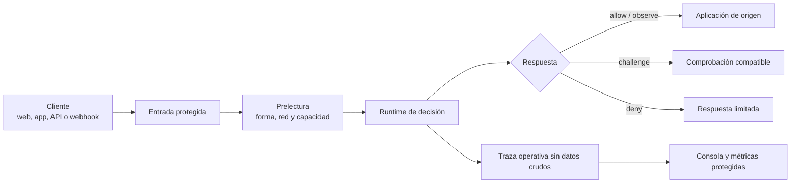
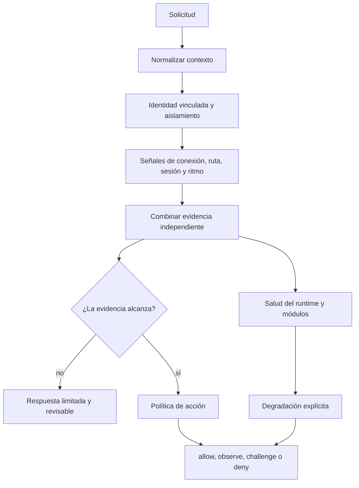

# Arquitectura pública

Esta vista explica el recorrido sin exponer nombres internos ni detalles que ayuden a esquivar controles.

## Recorrido de una solicitud

La consola y la telemetría son salidas de operación. No son una segunda entrada hacia la aplicación.

## Qué ocurre dentro del runtime

## Fronteras que deben mantenerse

- La entrada pública es la única puerta hacia el origen
- La aplicación no confía en cabeceras de transporte que el cliente pueda escribir
- Los proxies confiables se declaran por red, no por una cabecera cualquiera
- La consola requiere autenticación y no se publica por defecto
- Redis coordina el estado compartido cuando está disponible; el estado local se marca como limitado
- La telemetría usa identificadores derivados, límites y retención definida

## Redes compartidas

Hoteles, oficinas, campus, operadores móviles, VPN y CGNAT pueden poner a muchas personas detrás de una misma dirección pública. Por eso una IP puede aportar contexto de red, pero no debe bastar para bloquear a todos.

## Qué no debe inferirse

Un fingerprint no identifica por sí solo a una persona. Un challenge superado no concede confianza permanente. Una señal ausente no prueba abuso. La decisión tiene que conservar alcance, motivo y nivel de evidencia.
