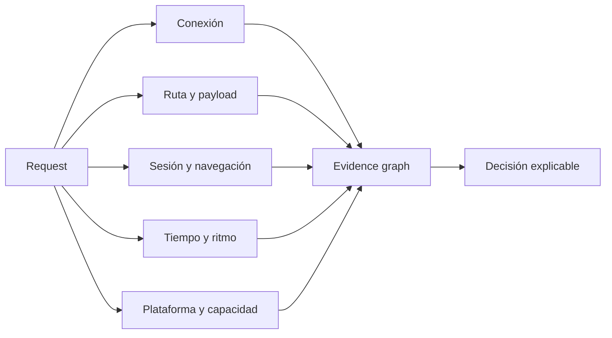

# Familias de motores

AbuseShield no depende de un único detector. Cada familia mira una parte distinta del recorrido y el runtime controla cuánto peso puede tener cuando la señal es débil, repetida o contradictoria.

## Mapa de lectura

## Conexión y red

Observa la forma de la conexión, cabeceras, TLS cuando está disponible y el contexto del proxy. Sirve para detectar incoherencias o cambios, no para declarar maliciosa una VPN o una red compartida.

## Ruta, payload y repetición

Compara la forma de las rutas, parámetros y cuerpos con el recorrido de la sesión. Busca secuencias imposibles, reutilización anómala y repetición. Los valores se reducen a formas operativas; no se necesita conservar el cuerpo crudo para explicar la decisión.

## Sesión y navegación

Lee el orden de las acciones, los cambios de objetivo, los reintentos y la evolución de la intención. Una visita corta no se considera sospechosa solo por ser corta; hace falta contexto suficiente.

## Tiempo y ritmo

Mide intervalos, regularidad, pausas y cambios de ritmo. El comportamiento humano no sigue una única distribución y una señal temporal aislada no debe bloquear una sesión.

## Plataforma y capacidad

Distingue navegador, API, webhook, app nativa, WebView y dispositivo limitado. JavaScript, cookies, almacenamiento y pruebas de plataforma pueden no existir. El challenge se negocia con esa capacidad.

## Memoria y campañas

Relaciona eventos cuando hay pivotes suficientes y dentro del tiempo de retención. Una IP, una ruta común o un reintento de idempotencia no deberían unir campañas por sí solos. La memoria compartida se degrada de forma visible si Redis no está sano.

## Integridad móvil

App Attest y Play Integrity requieren verificación real del proveedor. Un User-Agent móvil, una cabecera propia o una prueba local no sustituyen esa evidencia. Hasta contar con el proveedor configurado, el estado debe mostrarse como no verificado.

## Cómo se combinan

El resultado final no es la suma ciega de todos los motores. El runtime controla presupuestos, salud, contradicciones, confianza y alcance. Una señal duplicada por varios módulos debe contarse como una familia de evidencia, no como varias pruebas independientes.
