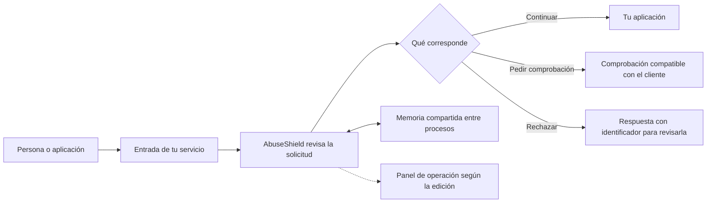

# Usar AbuseShield

AbuseShield revisa las solicitudes que recibe una aplicación y decide cuáles
dejar pasar, cuáles comprobar y cuáles rechazar. Esta guía te acompaña desde
el primer arranque hasta la revisión de una decisión.

## ¿Qué necesitas hacer?

| Tarea | Guía |
|---|---|
| Probarlo por primera vez en tu equipo | [Instalar y abrir el servicio](instalar.md) |
| Elegir qué servicios vas a mantener | [Elegir una edición](ediciones.md) |
| Usar tus propias claves o recuperar el acceso al panel | [Claves y acceso](claves.md) |
| Llevarlo a un servidor alquilado o a tu propia máquina | [Instalar en un servidor](servidor.md) |
| Revisar solicitudes y atender un bloqueo equivocado | [Trabajo diario](operar.md) |
| Resolver un arranque rechazado o una página que no responde | [Resolver problemas](problemas.md) |
| Preparar una actualización, una copia o una vuelta atrás | [Cambios y recuperación](cambios.md) |

Puedes empezar sin elegir contraseñas: el primer arranque genera las claves
internas y las conserva para los siguientes. Publicar tu aplicación en Internet
es un paso posterior; necesita una dirección, un certificado y una conexión
correcta entre AbuseShield y la aplicación.

## Cómo encajan las piezas

Este dibujo describe la integración: arrancar los contenedores no conecta por
sí solo una tienda, una API o una app que ya tengas. Ese enlace se configura en
[la integración web](../integrations/web.md) o [Laravel](../integrations/laravel.md).

## Referencia interna

La [arquitectura](../ARCHITECTURE.md), los [motores](../engines.md), la
[configuración completa](../configuration.md) y los
[contratos móviles](../integrations/mobile-protocol.md) siguen en sus documentos
técnicos. Las guías de esta carpeta se centran en tareas, comandos y resultados
que puedes comprobar.
