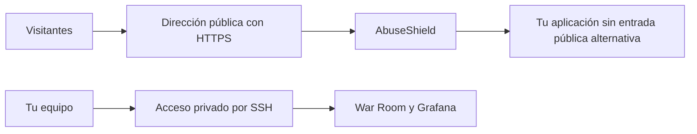

# Instalar en un servidor

Puedes usar una máquina Linux propia o un servidor virtual alquilado, también
llamado VPS. Lo importante es que permita ejecutar Docker, conservar volúmenes
y configurar la red. Un alojamiento que solo acepte subir archivos PHP no basta.

## Antes de elegir el host

| Comprueba | Por qué importa |
|---|---|
| Docker Engine y Compose 2.24.4 o posterior | Las ediciones usan funciones de composición que versiones antiguas no entienden |
| Espacio persistente | Las claves, el estado y el historial deben sobrevivir a recrear contenedores |
| Acceso para administrar puertos y firewall | La aplicación pública y los paneles privados necesitan accesos distintos |
| Arquitectura de CPU e imágenes disponibles | Haber probado x86-64 no demuestra que todas las imágenes funcionen en ARM |
| Capacidades de red de los servicios de análisis | Algunos alojamientos restringen permisos que los servicios de `intelligence` o `lab` pueden necesitar |
| Memoria y disco durante carga | Un arranque correcto no mide cuánto tráfico soportará |
| Salida a Internet durante la construcción | Docker descarga imágenes y dependencias |

Compose no despliega automáticamente en Kubernetes ni en servicios gestionados
que usan su propio formato. Esos entornos necesitan adaptar redes, secretos,
almacenamiento y comprobaciones de salud. Revisa [las ediciones](ediciones.md)
antes de elegir recursos; no todas tienen el mismo coste operativo.

## Arrancar sin publicarlo todavía

Accede por SSH al servidor, sitúate en tu copia completa del repositorio y ejecuta:

```bash
./abuseshield up operations
./abuseshield status operations
curl -i http://127.0.0.1:8080/
```

Esos puertos escuchan solo en el propio servidor. `127.0.0.1` en tu portátil
apunta al portátil, no al VPS.

Para abrir los paneles sin publicarlos, ejecuta **en tu portátil** lo siguiente,
sustituyendo `usuario` y `servidor` por tu acceso SSH:

```bash
ssh -N -L 18080:127.0.0.1:8080 -L 13001:127.0.0.1:3001 usuario@servidor
```

Mientras esa conexión esté abierta, usa
<http://127.0.0.1:18080/abuseshield/admin> y <http://127.0.0.1:13001>.
La autenticación del panel sigue siendo necesaria.

## Conectar tu aplicación y publicar HTTPS



El Compose incluido sirve el runtime de AbuseShield. No detecta dónde vive tu
aplicación ni cambia sus rutas por ti. Completa la
[integración web](../integrations/web.md) o [Laravel](../integrations/laravel.md)
y comprueba que una solicitud llegue a tu aplicación pasando por la protección.

Para publicar, necesitas una dirección y un certificado válido. El certificado
autofirmado inicial solo sirve para pruebas locales. La configuración del
servidor frontal debe permitir las rutas de usuario, mantener privados los
endpoints administrativos y evitar que se pueda llegar directamente a la
aplicación saltando AbuseShield.

Si hay otro proxy delante, configura cuáles de sus direcciones son de confianza.
No aceptes una dirección de visitante solo porque aparece en un header: un
cliente también puede enviar esos datos. Consulta
[la configuración técnica](../configuration.md) y [HTTPS](../runbooks/tls-edge.md)
para adaptar esa frontera a tu infraestructura.

## Dos instalaciones en la misma máquina

Desde la carpeta de una edición, usa otro nombre y puertos libres. Mantén estas
variables en esa terminal para todas las operaciones del segundo despliegue:

```bash
export ABUSE_SHIELD_COMPOSE_PROJECT=abuseshield-pruebas
export ABUSE_SHIELD_HTTP_PORT=8180
export ABUSE_SHIELD_HTTPS_PORT=8543
export ABUSE_SHIELD_GRAFANA_PORT=3101
./abuseshield up operations
./abuseshield status operations
```

Cambiar solo los puertos no separa el estado: el nombre del proyecto es el que
selecciona sus redes y volúmenes. No compartas los volúmenes entre instalaciones
que deban ser independientes.
