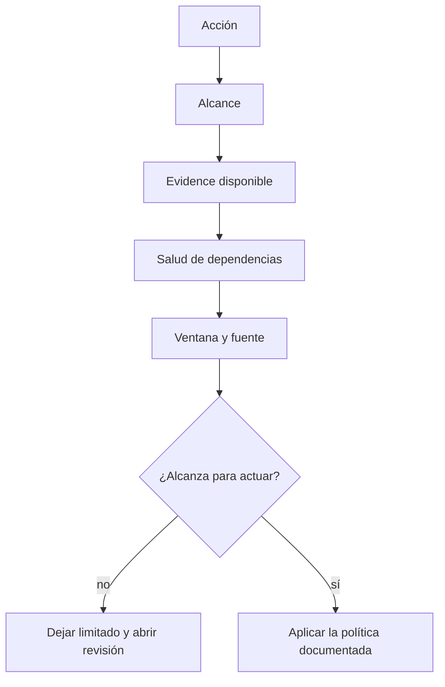

# Operación

## Qué mirar primero

1. Acción aplicada
2. Alcance de la acción
3. Evidencia disponible
4. Salud de dependencias
5. Ventana y fuente de los datos

Un panel sin datos significa que hay que revisar la fuente y su salud. No significa cero abuso.

## Orden de una revisión

## Acciones

| Acción | Lectura |
| --- | --- |
| `allow` | La solicitud continúa |
| `observe` | Continúa y deja evidencia |
| `challenge` | Pide una comprobación compatible con el cliente |
| `deny` | La solicitud se rechaza |
| `degraded` | La decisión está limitada por una dependencia o módulo no confiable |

## Casos que requieren contexto

Una persona con VPN, Firefox endurecido, bloqueadores, móvil inestable o una red compartida no debe bloquearse por una sola señal. Comprueba la secuencia completa y el alcance antes de cambiar un umbral.

## Vuelta atrás

Antes de una actualización conserva el identificador de versión, las imágenes y el estado compatible. Si salud, autenticación o decisiones cambian de forma inesperada, detén la ampliación y vuelve al conjunto conocido.

## Falso positivo y omisión

Un falso positivo es una persona legítima que recibió más fricción de la necesaria. Una omisión es actividad abusiva que avanzó más de lo esperado. En ambos casos conserva la solicitud reducida, la ruta, la ventana, la acción y las señales que realmente participaron. No subas un umbral global por un solo caso.
